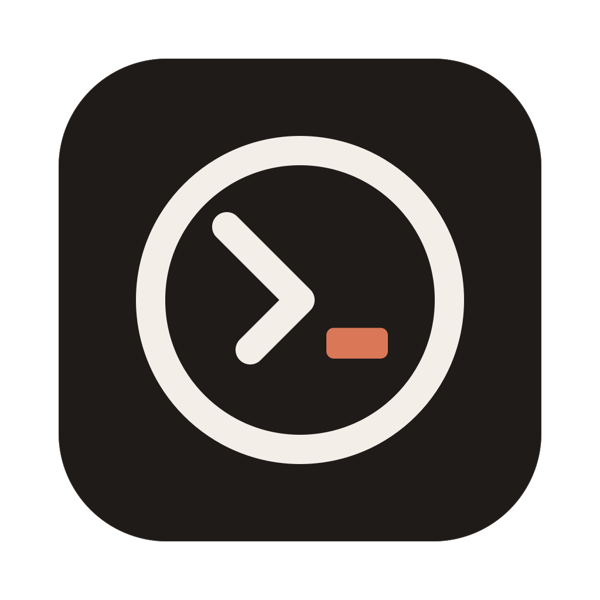
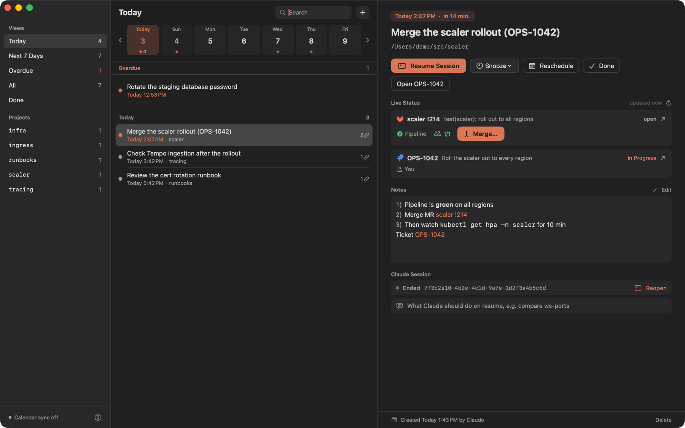
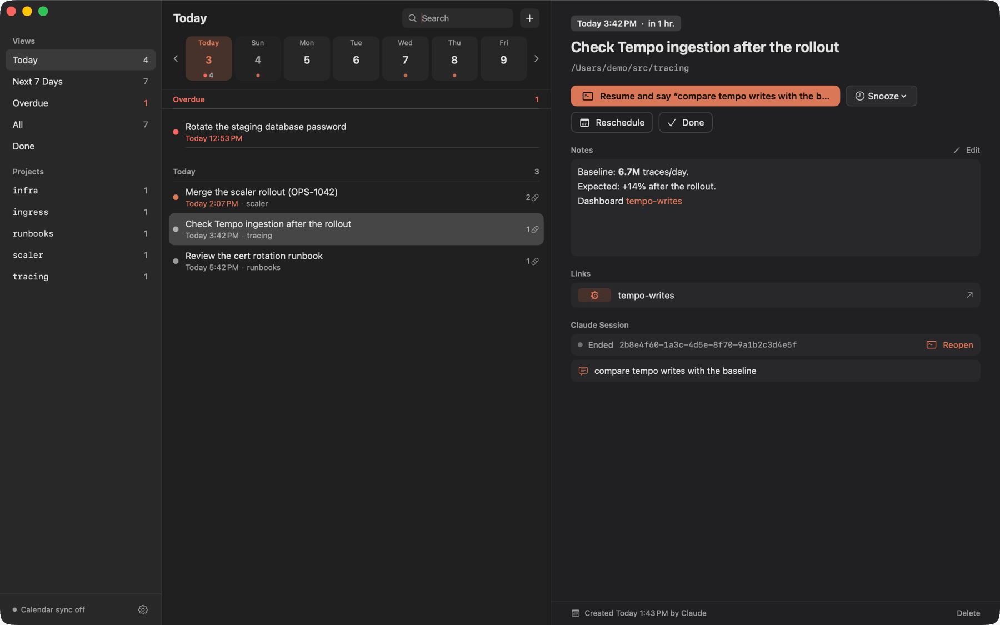
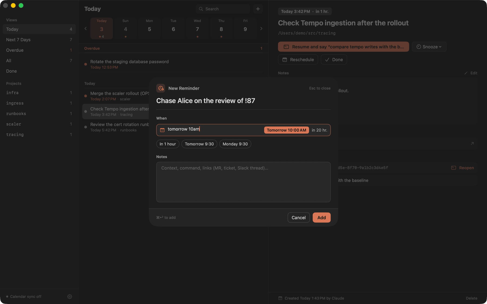
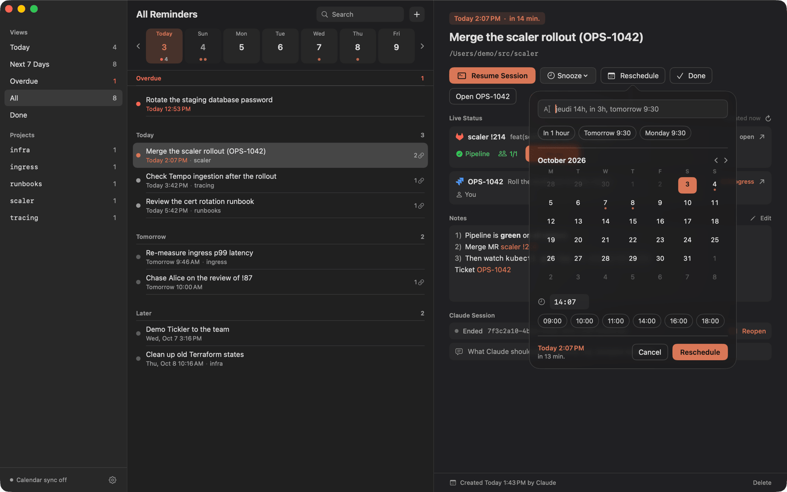

<p align="center">
  
</p>

<h1 align="center">Tickler</h1>

<p align="center">Reminders that Claude Code writes for you, with a macOS menu bar app that notifies you on time and brings the Claude session back in one click.</p>



- **The Claude Code skill** ([`skills/tickler`](skills/tickler/SKILL.md)): teaches Claude when and how to create reminders, with the session, the links and the prompt to resume with, and to offer follow-ups on its own (chase a review two days after opening an MR, re-measure 24 h after a rollout).
- `tickler`: the CLI Claude uses to add, list and close reminders (JSON output).
- `Tickler.app`: menu bar item with a badge, a window filtered by date, notifications with actions (resume the session, snooze, reschedule, done, open the ticket or Slack thread), live status of the linked MRs, tickets and PRs with an Approve button, and a one-way copy of every reminder into a calendar of your choice.

Both share one SQLite file: `~/Library/Application Support/Tickler/tickler.sqlite`. The CLI works while the app is closed; the app picks up its changes instantly.

Requirements: macOS 14 or later; to build from source, Xcode 16 or later and [XcodeGen](https://github.com/yonaskolb/XcodeGen). Optional: [WezTerm](https://wezterm.org), [Ghostty](https://ghostty.org) or [iTerm2](https://iterm2.com) for session resume; `glab`, `jira` ([jira-cli](https://github.com/ankitpokhrel/jira-cli)) and `gh`, logged in, for live status.

| Resume with a prompt | New reminder | Reschedule |
|---|---|---|
|  |  |  |

## Install

```bash
brew install --cask pixibixi/tap/tickler
# Installs /Applications/Tickler.app and the tickler CLI, then open Tickler once to set it up
```

The release is signed with a self-signed certificate, not notarized: the cask removes the quarantine flag so macOS opens it. Permissions granted to Tickler survive upgrades, as every release uses the same certificate.

From source:

```bash
brew install xcodegen
make install
# Installs ~/.local/bin/tickler and ~/Applications/Tickler.app
open ~/Applications/Tickler.app
```

The app is ad-hoc signed by default, so macOS asks for the calendar and automation permissions again after every rebuild. To keep them, create a local signing identity once (it asks for your password to trust the certificate); `make` then uses it automatically:

```bash
scripts/create-local-signing-identity.sh
```

Or, with an Apple Development certificate (Xcode, Settings, Accounts, your Apple ID, Manage Certificates), sign with your team:

```bash
make install DEVELOPMENT_TEAM=XXXXXXXXXX
```

## Claude Code skill

The skill is what makes Claude use Tickler: "remind me to merge this tomorrow at 10am" becomes a reminder tied to the current session, with the MR link and the prompt to resume with.

```bash
tickler skill install
# installed  ~/.claude/skills/tickler/SKILL.md (Claude Code picks it up in the next session)
```

The setup assistant and Settings offer the same button. The skill ships with each version: run it again after an upgrade, `tickler skill status` tells whether the installed one is current.

| Ask Claude | It runs |
|---|---|
| "remind me to merge this tomorrow 10am" | `tickler add` with the session, folder, MR link and a resume prompt |
| "check yesterday's reminders" | `tickler list --due today --json`, then `tickler status` on linked MRs and tickets before acting |
| "push it to Monday" / "it's done" | `tickler edit --at` / `tickler done` |
| (after opening an MR or rolling out a change) | Offers a follow-up: `--when approved` once the MR is open (a dated chase when the project has no approval rule), a re-measure against the baseline after a rollout |

## Claude Code hook

When a session starts, Claude hears about the reminders of that repository (fired, overdue, due today, waiting), with links that open them, plus a count of overdue ones elsewhere; it mentions them and does nothing unless asked.

```bash
tickler hook install
# installed  ~/.claude/settings.json (a SessionStart hook; new sessions and /clear only)
```

`tickler hook status` tells whether it is there, `tickler hook uninstall` removes it; the file's other content and key order are kept, and a symlinked settings file stays linked.

## CLI

| Command | Does |
|---|---|
| `tickler add <title> --at "YYYY-MM-DD HH:MM"` | Creates a reminder. `--when <event>` (`merged`, `pipeline-green`, `pipeline-failed`, `approved`, `jira:done`, `jira:<status>`; without `--at`, the deadline is 3 working days at 09:30), `--notes <text>` or `--notes -` (stdin), `--link <url>` (repeatable), `--session <uuid>`, `--cwd <dir>`, `--prompt <text>` (first message to Claude on resume), `--json` |
| `tickler list` (alias `ls`) | Open reminders. `--due today` (default, overdue included), `week`, `overdue`, `all`; `--project <name>`; `--status done`; `--waiting`; `--json` |
| `tickler show <id>` | One reminder with notes, links and session. `--json` |
| `tickler done <id>` | Marks it done |
| `tickler snooze <id> --for 1h` | Pushes it back from now: `15m`, `1h`, `2d`. Or `--to "YYYY-MM-DD HH:MM"` |
| `tickler edit <id>` | `--title`, `--at`, `--notes <text>` or `--notes -`, `--prompt <text>` (`""` removes it), `--when <event>` (`""` removes it) |
| `tickler rm <id>` | Deletes it |
| `tickler resume <id>` | Focuses the tab of the reminder's Claude session in WezTerm, Ghostty or iTerm2, or reopens it with `claude --resume` in the reminder's folder. A resume prompt is sent as the first message of a reopened session, and typed without Return into a running one (WezTerm, iTerm2). `TICKLER_TERMINAL=wezterm\|ghostty\|iterm` picks where new tabs open |
| `tickler status <id>` | Live state of the linked GitLab MRs, Jira issues and GitHub PRs (pipeline, approvals, ticket status, checks). `--json` |
| `tickler completion zsh` | Prints the shell completion script (also `bash`, `fish`): subcommands, options, and reminder ids with their title |
| `tickler skill install` / `status` | Installs the Claude Code skill of this version in `~/.claude/skills/tickler` (`$CLAUDE_CONFIG_DIR` honored); an edited skill is only replaced with `--force` |
| `tickler hook install` / `status` / `uninstall` | Adds, checks or removes the SessionStart hook in `~/.claude/settings.json` (`$CLAUDE_CONFIG_DIR` honored); only Tickler's own entry is touched |
| `tickler hook session-start` | Run by Claude Code, not by hand: reads the hook JSON on stdin, prints the digest of the session's repository or nothing, always exits 0 |
| `tickler version` | Prints the version (also `--version`) |
| `tickler import-apple --list Claude` | One-shot import of the open reminders of an Apple Reminders list, which is left untouched |

- Completion: add `source <(tickler completion zsh)` to `~/.zshrc`; `tickler rm <Tab>` then lists open reminders as `id -- date title`.
- `--session` defaults to `CLAUDE_CODE_SESSION_ID`, and `--cwd` to the current directory when a session is known.
- Dates on the CLI take only the strict local format `YYYY-MM-DD HH:MM`.
- In a terminal, `list` prints a table grouped by Overdue, Today, Tomorrow, Later, and each id is a link that opens the reminder in the app (⌘-click in WezTerm, Ghostty or iTerm2). Piped, or with `NO_COLOR`, it prints one plain line per reminder.
- Exit codes: `0` ok, `1` runtime error, `2` usage error, `3` unknown id.
- `TICKLER_DB=<path>` (or the hidden `--db <path>`) points everything at another database.

### JSON

`list --json` prints an array, the other commands one object:

```json
{
  "id": "r8wh83",
  "title": "OPS-2204: check le dashboard CTO",
  "notes": "Epic https://acme.atlassian.net/browse/OPS-2204",
  "due": "2026-10-01 11:00",
  "dueISO": "2026-10-01T11:00:00+02:00",
  "firedAt": null,
  "firedReason": null,
  "originalDue": "2026-10-01 11:00",
  "rescheduleCount": 0,
  "status": "open",
  "source": "claude",
  "sessionId": "5b26f281-1806-47aa-8842-0e264f7b9d35",
  "cwd": "/Users/you/src/platform-services",
  "project": "platform-services",
  "overdue": false,
  "trigger": null,
  "waiting": false,
  "links": [{ "kind": "jira", "label": "OPS-2204", "url": "https://acme.atlassian.net/browse/OPS-2204" }]
}
```

`trigger` is the awaited event; once it fires, `firedReason` says why (`MR !412 merged`) and the reminder is due at `firedAt`.

Link kinds: `gitlabMR`, `jira`, `grafana`, `slack`, `githubPR`, `other`.

## App

| Where | What |
|---|---|
| Menu bar | Count of today's reminders (overdue included); the glyph turns solid while one is overdue. The popover shows the next reminder with Resume, Snooze and Done, then overdue, today, tomorrow and later |
| Window | Views (Today, Next 7 Days, Overdue, All, Done), projects from the session folder, a Waiting group, a 7-day strip to filter on a day, search, and a detail pane where title, date, notes and resume prompt edit in place |
| Notifications | One per reminder at its time, with Resume Session, Snooze 15 min, Snooze 1 hour, Tomorrow 09:30, Reschedule (type "thursday 2pm" or "in 3h"), Open Ticket, Open Slack Thread or Open Link, Mark Done. Reminders missed while the Mac slept are notified on wake, as one summary beyond three |
| Live status | For each linked GitLab MR, Jira issue or GitHub PR: pipeline, approvals, threads, conflicts, ticket status and assignee, checks. **Approve…** appears when GitLab says you may approve, and asks for confirmation first. Data from `glab`, `jira` and `gh`, refreshed when older than 2 minutes. The Jira API token goes in Settings > Live Status, kept in the keychain and passed to `jira` as `JIRA_API_TOKEN`; without it, `jira` falls back to its own config and your login shell |
| Triggers | Every 5 minutes while the app runs, reminders waiting for an event check their links; when it happens the reminder becomes due now and notifies with the reason. **Stop Waiting** in the detail pane keeps the date and drops the event |
| Calendar | Every open reminder from 7 days ago to 60 days ahead becomes a 15 min event marked Free, without alert, with a `tickler://open/<id>` link |

URLs: `tickler://open/<id>` opens a reminder, `tickler://view/today|week|overdue|all|done` opens the window on that view.

Keyboard: `⌥⌘N` new reminder from any app (Settings to turn it off), `⌘N` new reminder, `⌘R` resume the session, `⌘↩` mark done, `⌘O` open the window from the popover.

The date fields accept French and English: `demain 9h30`, `lundi 10h`, `dans 2h`, `tomorrow 3pm`, `monday 10am`, `in 45 minutes`, `2026-10-06 10:00`.

### Settings

| Setting | Default |
|---|---|
| Calendar | None. Pick a writable calendar, for instance a "Claude" calendar created in Google Calendar with its default notifications set to none |
| Terminal | Automatic: a running session is found in WezTerm, Ghostty or iTerm2; new tabs open in the first one running. Or pick one of those installed, which then always gets the new tabs. Ghostty 1.3 cannot tell which tab holds a session: Tickler brings Ghostty forward instead of the exact tab |
| WezTerm binary | Found automatically in `/opt/homebrew/bin`, `/usr/local/bin`, then the app bundle |
| Session Start Hook | Installs or removes the Claude Code hook (same as `tickler hook install`) |
| Language | System, or force English or French (after a relaunch) |
| Open at login | Off |

For notifications to stay on screen until you act, set Tickler's alert style to **Persistent** in System Settings, Notifications.

### Troubleshooting

| Symptom | Fix |
|---|---|
| After each upgrade, "Tickler wants to access key Tickler: Jira API token in your keychain" | Enter your password and click **Always Allow**, once per version. Without an Apple Developer account, macOS ties the keychain entry to the exact build, not to the signing certificate |
| Calendar, notifications or terminal access asked again after switching from a source build to the cask | Expected once: the two builds are signed with different certificates. Grant it again; later `brew upgrade`s keep it |
| A Jira card shows `jira: ...` instead of the ticket | Save the Jira API token in Settings > Live Status, or check `jira me` in a terminal |

## Development

| Command | Does |
|---|---|
| `make build` | Builds the package (core and CLI) |
| `make test` | Runs the Swift Testing suites |
| `make lint` | SwiftLint (strict) and SwiftFormat check |
| `make format` | Applies SwiftFormat |
| `make app` | Generates `Tickler.xcodeproj` with XcodeGen and builds the app |
| `make dev` | Incremental Debug build of the app, installed and relaunched (about 10 s) |
| `make install` / `make uninstall` | Installs or removes the CLI and the app (Release) |
| `scripts/bump.sh [--push]` | Cuts a release: next version from the commits ([cocogitto](https://github.com/cocogitto/cocogitto)), `CHANGELOG.md`, signed commit and tag; the pushed tag runs the release workflow |
| `make release VERSION=x.y.z SIGN_IDENTITY=<name>` | Universal signed zip in `dist/`, as the release workflow publishes on a `v*` tag |
| `scripts/create-release-signing-certificate.sh <owner/repo>` | Once: creates the release certificate and stores it as the repository's secrets |

`lefthook install` sets up the pre-commit (format, lint, gitleaks, markdownlint, actionlint) commit-msg (Conventional Commits) and pre-push (`swift test`, plus `make app` when the app or the core changed) hooks. Debug builds write PNGs of their windows when started with `TICKLER_SNAPSHOT=<dir>`.

Layout: `Sources/TicklerCore` (model, store, date parsing, planners, session resume, live status), `Sources/TicklerCLI`, `App/` (SwiftUI app), `project.yml` (XcodeGen), `assets/brand` (icon masters). Design notes live in `docs/superpowers`.

## License

MIT
